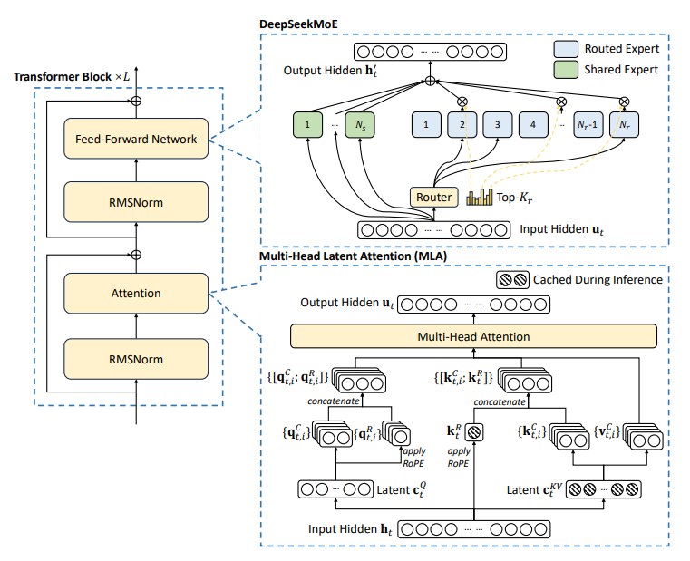

# DeepSeek-V3 — Deep Dive & Mathematical Breakdown

**DeepSeek-V3 Paper:** [DeepSeek-V3](./assets/DeepSeek-V3.pdf)



## 📌 Overview

DeepSeek-V3 is a **671B-parameter Mixture-of-Experts (MoE) Transformer** with ~**37B active parameters per token**, combining several innovations:

* **Multi-Head Latent Attention (MLA)** → a low-rank key/value architecture that reduces KV cache + bandwidth costs.
* **DeepSeekMoE** → a properly *aux-loss-free balanced* MoE routing strategy.
* **Multi-Token Prediction (MTP)** → predicts multiple next tokens (used for speculative decoding).
* **FP8 Low-Precision Training** → safe, stable, high-efficiency mixed precision.
* **Large-scale distributed training optimizations** (all-to-all, DualPipe, etc.).

Let's walk through **the math**, **the mechanisms**, **intuition**, and **practical insights** required if you want to implement similar systems.

## 1. Multi-Head Latent Attention (MLA)

### 🎯 Goal

Compress Keys/Values into a **shared low-rank latent** representation per token to drastically reduce:

* KV cache memory
* bandwidth during inference
* cost per token in long contexts

while keeping near-full attention expressiveness.

### 🔢 MLA Architecture (Mathematical Formulation)

Given input token representation:

```math
h_t ∈ ℝ^d
```

#### **1. Create a low-dim latent KV embedding**

```math
c_t^{KV} = W^{DKV} h_t
```

* Dimension: `r << d` (r is latent size)

#### **2. Decode per-head compressed Keys**

```math
k^c_{t,i} = W^{UK}_i \, c_t^{KV}
```

* Each head `i` gets its own decoded key.

#### **3. Decode per-head compressed Values**

```math
v^c_{t,i} = W^{UV}_i \, c_t^{KV}
```

#### **4. Add a RoPE-encoded sub-key**

```math
k^R_t = RoPE(W^{KR} h_t)
```

Final key for head `i`:

```math
k_{t,i} = [\, k^c_{t,i},\; k^R_{t,i} \,]
```

#### **5. Run Standard Attention**

```math
Attn(q_t) = softmax( q_t Kᵀ / √d_h ) V
```

### 🧠 Intuition

* Full KV = expensive → use a **shared** low-rank latent.
* Per-head expressiveness preserved via per-head decoders.
* KV Cache stores only **latent** instead of per-head KV → *huge* memory savings.
* RoPE part ensures positional structure is kept fully expressive.

### 📉 KV Cache Savings

If:

* `H = number of heads`
* `d_h = head_dim`
* Standard KV cost per token = `H × d_h × 2 (K+V)`
* MLA cost = `r × 1 (shared)`

Then:

```math
Saving ≈ (H × d_h × 2) / r
```

Often a **4×–8× reduction**.

## 2. DeepSeekMoE — Auxiliary-Loss-Free Routing

### 🎯 Problem with traditional MoE

Standard MoE needs a balancing auxiliary loss (Switch, GShard, Mixtral).
This:

* hurts specialization
* adds unstable hyperparameters
* can penalize tokens unevenly

### 💡 DeepSeek’s Solution

Remove sequence-wise auxiliary loss entirely.

Replace it with:

#### ✔ Batch-level balancing

#### ✔ Smarter capacity rules (no token dropping)

#### ✔ Router normalization tricks (sigmoid or softmax-topK normalization)

### 🔢 Routing Flow

Given router logits:

```math
g = Router(h_t)
```

Top-K selection:

```math
S = TopK(g, K)
```

Normalized weights:

```math
\tilde{g}_i = normalize(g_i | i ∈ S)
```

Expert output:

```math
y_t = Σ_{i ∈ S} \tilde{g}_i \cdot Expert_i(h_t)
```

### 🧠 Why Aux-Loss-Free Works

Batch-level balancing is enough to:

* enforce equal expert load
* keep high specialization
* avoid regularization hurting the model’s main objective

Ablations from the paper show:

* **Better specialization**
* **Better validation loss**
* **No token dropping**

## 3. Multi-Token Prediction (MTP)

### 🎯 Idea

Predict multiple future tokens instead of just one.

If predicting 2 tokens:

```math
L_MTP = - Σ_t [ log p(x_{t+1}|x≤t) + log p(x_{t+2}|x≤t) ]
```

BUT unlike naïve MTP, DeepSeek preserves:

* the **causal chain**
* internal depth computation per predicted token

This keeps gradient flow correct and avoids shortcut learning.

### 🧠 Why MTP Matters

* Enables speculative decoding → ~**1.8× faster inference**
* Helps internal planning structure
* Better representation learning in long contexts

## 4. FP8 Mixed-Precision Training

### 🎯 Purpose

Increase training throughput massively while maintaining:

* numerical stability
* convergence
* safe scaling laws

### ✔ Key Techniques

* FP8 storage for activations/weights where safe
* BF16/FP16 accumulations for reductions
* Dynamic scaling per layer + per tensor
* Quantization-aware matmul kernels
* Communication in FP8 to reduce bandwidth

### 🧠 Why It Works

All the stability issues of FP8 disappear with:

* correct calibration
* safe accumulation paths
* layer-wise dynamic scaling

DeepSeek shows stable FP8 training up to **hundreds of billions of parameters**.

## 5. Post-Training (SFT + RL)

DeepSeek performs:

### ✔ Supervised Fine-Tuning (SFT)

### ✔ RLHF using **GRPO** — Group-Relative Policy Optimization

GRPO resembles PPO but more stable in the multi-expert large-context setting.

## 6. Engineering / Scaling Tricks

### 🚀 DualPipe

Overlaps forward/backward communication with computation.

### 🚀 Large-scale All-to-All Optimizations

Critical for MoE dispatch.

### 🚀 KV Cache Quantization

FP8/BF16 hybrid caching.

### 🚀 Mixture-of-Model patterns

Pretraining uses only MoE (no dense-only layers), improving GPU efficiency.

## 7. Implementation Roadmap

### 1. Implement MLA

* Low-rank latent → per-head decoding
* KV caching only stores latents
* Validate per-layer RoPE integration

### 2. Implement MoE Layer

* Batch-level balancing
* Token dispatcher + gatherer
* No auxiliary loss

### 3. Implement MTP

* Forward graph must retain multi-depth causal computation

### 4. Mixed-Precision Engine

* FP8 quantization kernels
* Safe scaling
* FP8 all-to-all communication

### 5. Distributed Training

* Pipeline parallel + DualPipe
* Expert parallelism for MoE
* ZeRO stage-3/4 or custom sharding

## 8. Summary Table (Drill-Down)

| Component        | Purpose                  | Math/Mechanism                      | Benefit                            |
| ---------------- | ------------------------ | ----------------------------------- | ---------------------------------- |
| **MLA**          | Low-rank KV cache        | latent `c_t = W h_t`, decode to K/V | 4–8× KV savings                    |
| **DeepSeekMoE**  | Balanced expert dispatch | Top-K routing, batch-level balance  | Better specialization, no aux loss |
| **MTP**          | Predict >1 tokens        | two-step causal loss                | ~1.8× speedup                      |
| **FP8 training** | Efficiency               | FP8 storage + BF16 accumulation     | Faster, less memory                |
| **GRPO**         | RLHF                     | group-relative PPO                  | Stable RLHF                        |
